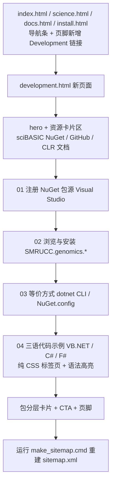

## 产品概述

GCModeller 官网（静态站点，`gh-pages` 分支）目前只有面向生物信息学研究人员的 `install.html`（Docker 镜像 + R# 脚本化编程）。本次新增一个面向 .NET 开发者的独立页面 `development.html`，讲解如何在 Visual Studio 中通过 NuGet 包管理器从 sciBASIC.NET 基金会的 NuGet 分发平台获取 GCModeller 程序包、进行生物信息学 .NET 程序开发。两个页面面向不同层次的使用者，互不干扰。

## 核心功能

- **install.html 保持正文不变**：Docker + R# 的 01–04 章节一字不改，仅在其顶部导航条与页脚站点链接中新增 Development 入口。
- **新建 development.html**：

1. 说明 GCModeller 的 NuGet 包托管在 sciBASIC.NET 基金会的 NuGet 分发平台，给出包浏览入口 <https://nuget.scibasic.net/tags.html?tag=gcmodeller>（该源带 `gcmodeller` 标签的包共 93 个）；
2. 教程章节：在 Visual Studio 中注册包源 `https://nuget.scibasic.net/v3/index.json` → 在「Manage NuGet Packages」中切换包源并安装 `SMRUCC.genomics.*` 包 → 等价方式（`dotnet nuget add source` 命令行与 `NuGet.config` XML 片段）→ 包层次说明（`SMRUCC.genomics.core` 基础核心库 + 注释/分析/数据读取等方向包）+ VB.NET 项目 `Imports` 起步；
3. **真实代码示例**：以 `G:\GCModeller\src\GCModeller\annotations\Bifrost\Bifrost\Program.vb`（Bifrost 基因预测 CLI：Prodigal / MetaEuk）为蓝本，给出 **VB.NET / C# / F# 三语对照代码**，带语法高亮与语言切换标签页；
4. 指向站内 `vignettes/clr/` 的 .NET CLR 类型文档作为 API 参考。

- **站点导航接入**：`index.html`、`science.html`、`docs.html`、`install.html` 的顶部导航与页脚站点链接均加入 Development。
- **更新 sitemap**：页面完成后运行 `G:\gcmodeller.org-website\make_sitemap.cmd` 重建 `sitemap.xml`。

## 视觉与呈现

沿用站点深色学术风（近黑底 + GCModeller 红 + 钢灰蓝），新页面与现有页面视觉完全一致；代码块带三色交通灯标题栏与语法高亮配色；三语代码用纯 CSS 标签页切换；不引入任何新图片、新 CDN 与第三方库。

## 技术栈选型

- 站点现状：纯静态 GitHub Pages（`gh-pages` 分支），手写 HTML + 单一主题 `assets/css/theme.css`，无构建流程、无前端框架。
- 沿用现有栈：**原生 HTML + CSS**，字体沿用已在 `<head>` 引入的 Inter + JetBrains Mono；**不新增 JS、不新增 CDN**（与 `install.html` / `docs.html` / `science.html` 一致）。
- 语法高亮：沿用 `install.html` 既有做法——**手写 `<span class="…">` token + theme.css 配色**。不使用 `lib/vbcode.min.js`（仅支持 VB 且依赖 linq/jquery，且无法覆盖 C#/F#）。
- 三语切换：**纯 CSS 的 `radio + label` 标签页**（`:checked` + 兄弟选择器），零 JS，禁用 JS 时全部面板仍按顺序可读。

## 实现思路

1. **先补齐样式再写页面**：`theme.css` 中已被 `install.html`、`docs.html` 使用却从未定义的 `.code-bar` / `.tb` / `.code-title` / `.mono-inline` 以及语法 token `.p .c .k .s .f .o`、新增的类型色 `.t`、特性色 `.a`、语言标签页样式，全部追加到「Code blocks」区块内（`.code pre` 之后），**不修改任何既有规则**，避免影响首页 `index.html`（其另用 `assets/css/index.css`）。补齐后 `install.html` 的 4 个既有代码块与 `docs.html` 的 1 个代码块一并受益，属纯增益修复。
2. **新页面复用既有组件体系**：`.page-hero` / `.kicker` / `.lead` / `.sec` / `.sec-num` / `.card` / `.grid c3|c4` / `.code` / `.prose` / `.note` / `.pill` / `.btn` / `.btn.ghost` / `.site-footer`，头部导航与页脚结构逐字复制 `docs.html`。
3. **内容全部使用已核实事实**，禁止编造版本号与 API：包源 `https://nuget.scibasic.net/v3/index.json`、标签页 `https://nuget.scibasic.net/tags.html?tag=gcmodeller`、93 个包、真实包 ID 与命名空间、真实源码片段。
4. **sitemap**：`make_sitemap.cmd` 以 `Sitemap.exe`（已确认存在于 `G:\GCModeller\src\runtime\httpd\tools\`）扫描站点；脚本末尾有 `pause`，非交互式执行需绕开（如 `cmd /c "make_sitemap.cmd" < NUL`），执行后核对 `sitemap.xml` 中出现 `https://gcmodeller.org/development.html`。

## 实现要点（执行细节）

- **代码块模板一致性**（必须严格复制）：

```html
<div class="code">
<div class="code-bar"><span class="tb r"></span><span class="tb y"></span><span class="tb g"></span><span
class="code-title">Bifrost.vb — VB.NET</span></div>
<pre><code>…</code></pre>
</div>
```

- **XSS / DOM 安全**：`NuGet.config` 与 VB 泛型尖括号必须 HTML 转义（`&lt;` / `&amp;`）后写入 `<pre><code>`，避免破坏页面结构。
- **配色复用**：注释 `#56637a`、关键字 `#ff7a6e`、字符串 `#9ecb8f`、类型/成员 `#7fb3e0`、运算符 `#8ba0b9`、特性/注解 `#d7b3ff`、shell 提示符 `#7d94ad`——与主题已定义 `.cm/.kw/.st/.fn` 同色系。
- **外链规范**：一律 `target="_blank" rel="noopener"`；不新增图片资源（复用 `assets/img/logo.png`、`favicon.png`，如需 `` 带 `onerror`）。
- **性能**：纯静态文本，页面增量约 12–16 KB，无额外网络请求；`.code pre` 保留 `overflow-x: auto`，窄屏长命令横向滚动不破版；网格沿用主题既有 980px/620px 断点。

## 架构设计



## 目录结构

```
g:/gcmodeller.org-website/
├── development.html            # [NEW] 面向 .NET 开发者的 NuGet 开发页
│   #   1) <head>：title "Development — GCModeller"、meta description 讲 .NET/NuGet 路线
│   #   2) 头部 .nav（Overview / The Science / Install / Docs / Development / GitHub）
│   #   3) .page-hero：kicker ".NET Development"、h1 "Develop with GCModeller"、
│   #      .lead 说明 sciBASIC.NET 基金会 NuGet 分发平台与两类使用者定位
│   #   4) 资源卡片 .grid.c4：sciBASIC NuGet Feed(93 packages) / GitHub / CLR 文档 / R# Vignettes
│   #   5) 章节 01：Visual Studio 注册包源（Tools → Options → NuGet Package Manager →
│   #      Package Sources → https://nuget.scibasic.net/v3/index.json）+ .note 提示
│   #   6) 章节 02：Manage NuGet Packages 切换包源、搜索安装 SMRUCC.genomics.* + 标签页入口
│   #   7) 章节 03：dotnet nuget add source 代码块 + NuGet.config XML（转义）代码块
│   #   8) 章节 04：三语代码示例（VB.NET/C#/F#，纯 CSS 标签页 + 手写 span 高亮），
│   #      取自 Bifrost/Program.vb 的 Prodigal 与 MetaEuk 片段
│   #   9) 包分层 .grid.c3 卡片（core 基础库 / annotation 注释 / analysis 分析 / data 数据库）
│   #   10) CTA 按钮 + .site-footer（含 Development 链接）
├── assets/css/theme.css        # [MODIFY] 仅追加、不改既有规则
│   #   .code-bar / .tb(.r/.y/.g) / .code-title / .mono-inline
│   #   .code .p/.c/.k/.s/.f/.o/.t/.a 语法高亮 token 配色
│   #   .lang-tabs 纯 CSS 标签页（radio + label + :checked 兄弟选择器）
├── index.html                  # [MODIFY] 第 39–45 行 <nav class="links"> 插入 Development
├── science.html                # [MODIFY] 第 30–36 行导航 + 第 252–258 行 foot-links
├── docs.html                   # [MODIFY] 第 30–36 行导航 + 第 174–180 行 foot-links
├── install.html                # [MODIFY] 仅第 30–36 行导航 + 第 192–198 行 foot-links，正文 01–04 不动
└── sitemap.xml                 # [REGENERATED] 由 make_sitemap.cmd 重建，需含 development.html
```

受影响但不改动正文：`install.html` 的 Docker/R# 章节；`docs.html` 仅因样式补齐而视觉改善。

## 关键代码结构

纯 CSS 三语标签页（无 JS，禁用 JS 时全部面板可见）：

```html
<div class="lang-tabs">
  <input type="radio" name="lang" id="lang-vb" checked>
  <input type="radio" name="lang" id="lang-cs">
  <input type="radio" name="lang" id="lang-fs">
  <div class="lang-bar">
    <label for="lang-vb">VB.NET</label>
    <label for="lang-cs">C#</label>
    <label for="lang-fs">F#</label>
  </div>
  <div class="lang-panes">
    <div class="pane pane-vb">…code block…</div>
    <div class="pane pane-cs">…code block…</div>
    <div class="pane pane-fs">…code block…</div>
  </div>
</div>
```

对应的 CSS 契约（追加到 theme.css 的 Code blocks 区块）：

```css
/* language tabs: pure CSS, no JS */
.lang-tabs > input[type="radio"] { position: absolute; opacity: 0; pointer-events: none; }
.lang-tabs > input:checked + input + input + .lang-bar > label[for="lang-vb"],
.lang-tabs > #lang-cs:checked ~ .lang-bar > label[for="lang-cs"],
.lang-tabs > #lang-fs:checked ~ .lang-bar > label[for="lang-fs"] { /* active tab 样式 */ }
.lang-tabs .pane { display: none; }
.lang-tabs #lang-vb:checked ~ .lang-panes .pane-vb,
.lang-tabs #lang-cs:checked ~ .lang-panes .pane-cs,
.lang-tabs #lang-fs:checked ~ .lang-panes .pane-fs { display: block; }

/* syntax tokens */
.code .p { color: var(--steel); }        /* shell 提示符 */
.code .c { color: #56637a; }             /* 注释 */
.code .k { color: #ff7a6e; }             /* 关键字 */
.code .s { color: #9ecb8f; }             /* 字符串 */
.code .t, .code .f { color: #7fb3e0; }   /* 类型 / 成员 */
.code .o { color: #8ba0b9; }             /* 运算符 */
.code .a { color: #d7b3ff; }             /* 特性 / 注解 */
```

> 标签页 active 态的第一条选择器仅为示意，实现时统一用 `#lang-xx:checked ~ .lang-bar > label[for="lang-xx"]` 兄弟选择器写法，避免相邻选择器脆弱。

## 设计风格

沿用站点既有的「深色学术 / 生命科学」主题：近黑底 `#0a0d12`、GCModeller 红 `#ff3b2f` 作强调色、钢蓝灰 `#7d94ad` 作辅助色，玻璃拟态固定导航、红色极光背景光晕、卡片悬停微位移与红色描边。新页面只做「同风格扩展」，不引入新视觉语言、不使用 Tailwind 或任何组件库（站点为手写 HTML 静态站）。

## 页面规划（development.html 单页，自上而下分区）

1. **顶部导航条**：与全站一致（logo + Overview / The Science / Install / Docs / Development(active) / GitHub ↗），半透明玻璃拟态、当前页红色下划线。
2. **Hero 区**：kicker「.NET Development」带红色短线前缀，h1「Develop with GCModeller」，.lead 说明 NuGet 包托管于 sciBASIC.NET 基金会分发平台，并给出「面向 .NET 开发者」定位与外部平台按钮。
3. **资源卡片区**：`.grid.c4` 四卡（sciBASIC NuGet Feed / GitHub 源码 / CLR 类型文档 / R# Vignettes），卡片图标用 Unicode 字符、悬停红色描边与上浮。
4. **教程章节组 01–03**：每节带红色等宽序号「01/02/03」，含 Visual Studio 菜单路径代码块、dotnet CLI 代码块、NuGet.config XML 代码块与 .note 提示条。
5. **三语代码示例区 04**：纯 CSS 标签页（VB.NET / C# / F#），选中标签以红色底 + 白色文字标示，切换即时；代码块保留三色交通灯标题栏并标注语言与文件名 `Bifrost.vb / Bifrost.cs / Bifrost.fs`。
6. **包分层区**：`.grid.c3` 卡片组说明 `SMRUCC.genomics.core` 基础核心库与 annotation / analysis / data 各方向包。
7. **底部 CTA + 页脚**：红色主按钮「Browse the NuGet Packages ↗」与幽灵按钮「Back to Install」；页脚站点链接含 Development。

## 交互与响应式

锚点与标签页无 JS 依赖；代码块 `overflow-x: auto`；网格沿用主题 980px（降 2 列）与 620px（降 1 列）断点；卡片悬停 0.25s 微动效，按钮悬停上浮 2px 与红色投影。

## Agent Extensions

### SubAgent

- **code-explorer**
- Purpose: 在批量插入导航/页脚链接前，复核 `index.html`、`science.html`、`docs.html`、`install.html` 四个页面 `<nav class="links">` 与 `<nav class="foot-links">` 的精确行号与既有链接顺序，并确认 `development.html` 引用的 `assets/css/theme.css` token 类名在全站无命名冲突。
- Expected outcome: 输出精确插入点与受影响文件清单，确保四处导航改动一致、不误伤首页 `index.html` 的画布/启动层结构。