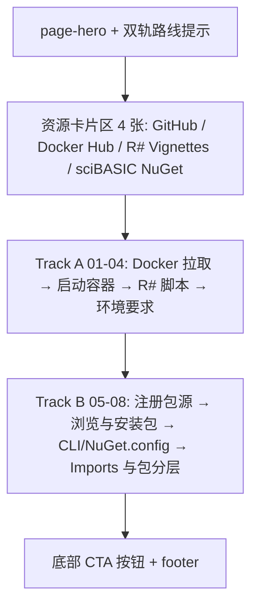

## 产品概述

GCModeller 官网（静态站点，`gh-pages` 分支）的安装页 `install.html` 目前只提供「Docker 镜像 + R# 脚本」一条使用路线。本次需将其改造为**双轨并列**的安装指南，新增「在 Visual Studio 中通过 NuGet 包管理器获取 GCModeller 程序包、进行生物信息学 .NET 程序开发」的完整教程，并明确告知用户：GCModeller 的 NuGet 包托管在其依赖的 sciBASIC.NET 基金会的 NuGet 分发平台上，浏览入口为 <https://nuget.scibasic.net/tags.html?tag=gcmodeller>。

## 核心功能

- **双轨路线说明**：页面顶部标注 Track A（Docker + R# 脚本）与 Track B（Visual Studio + NuGet 做 .NET 开发），提供锚点跳转，读者按需求二选一。
- **Track B 教程章节**（NuGet 获取与环境配置）：

1. 在 Visual Studio 中注册 sciBASIC 包源（Tools → Options → NuGet Package Manager → Package Sources → `https://nuget.scibasic.net/v3/index.json`）；
2. 通过 Manage NuGet Packages 切换包源、搜索并安装 `SMRUCC.genomics.*` 包，同时给出平台标签页浏览入口（该源现有 93 个 gcmodeller 标签包）；
3. 等价方式：`dotnet nuget add source` 命令行与 `NuGet.config` 配置片段；
4. 安装后在 VB.NET 项目中 `Imports SMRUCC.genomics.…` 即可开始开发，并说明包的层次（`SMRUCC.genomics.core` 为基础核心库，其余按注释、富集分析、宏基因组、序列工具、数据库读取等方向选用）。

- **示例代码范围**：仅 VB.NET，且只到「安装完成 → Imports 命名空间」为止，不写任何具体算法 API 调用，避免给出无法保证可编译的用法。
- **样式补齐**：修复 `assets/css/theme.css` 中缺失但已被 `install.html` / `docs.html` 使用的 `.code-bar`、`.tb`、`.code-title`、`.mono-inline` 与语法高亮 span 类，使新建与既有代码块正常呈现。

## 视觉与呈现

沿用站点深色学术风（近黑底 + GCModeller 红 + 钢蓝灰），新增章节保持既有 `.sec` / `.sec-num` / `.card` / `.grid c3` / `.code` / `.prose` / `.note` / `.btn` 组件风格，不引入任何新 JS 或第三方 CDN 依赖。

## 技术栈选型

- 站点现状：纯静态 GitHub Pages（`gh-pages` 分支），页面为手写 HTML + 单一主题样式 `assets/css/theme.css`，无构建流程、无前端框架。
- 沿用现有栈：**原生 HTML + CSS**，不新增 JS、不新增 CDN（与 `install.html` / `docs.html` / `science.html` 一致）。
- 字体：沿用 `<head>` 已引入的 Inter + JetBrains Mono。

## 实现思路

以「最小侵入 + 结构清晰」为原则改造 `install.html`：保留 Track A 的既有 01–04 全部内容，仅为其加上 Track A 标识与锚点；在其后追加 Track B 章节组。所有新增内容复用既有 class 与代码块模板，保证与站点其它页面视觉完全一致。同时补齐 `theme.css` 的缺失样式——这是既有 bug（代码块标题栏与语法高亮当前无任何规则命中），补齐后 `install.html` 的 4 个既有代码块与 `docs.html` 的 1 个代码块一并受益，属于低风险、纯增益改动。

关键决策：

- **不新增 JS**：双轨切换仅用锚点链接（`<a href="#track-a">`），避免引入 Tab 交互带来的可访问性与无 JS 降级问题；`html { scroll-behavior: smooth }` 已在主题中启用，锚点跳转自带平滑滚动。
- **编号体系**：Track A 保留 `01–04`，Track B 使用 `05–08` 保持页面连续，同时在每节 `.sec-head` 上方加路线徽标（`.pill`），并用 `id="track-a"` / `id="track-b"` 承载锚点。
- **包源信息准确性**：只使用已核实事实——服务索引 `https://nuget.scibasic.net/v3/index.json`、标签浏览页 `https://nuget.scibasic.net/tags.html?tag=gcmodeller`、`totalHits = 93`、包 ID 前缀 `SMRUCC.genomics.*`（示例：`SMRUCC.genomics.core` v10.5.3.8911、`SMRUCC.genomics.annotation.prodigal`、`SMRUCC.genomics.analysis.hts.gsea`、`SMRUCC.genomics.analysis.metagenome`），不编造版本号与 API。
- **示例边界**：VB.NET 代码块仅含 `Imports SMRUCC.genomics.…` 与占位注释，杜绝不可验证的 API 调用；.NET API 参考统一指向站内 `vignettes/clr/` 的 CLR 文档与 `vignettes/index.html`。

## 页面结构（改造后）



## 实现要点（执行细节）

- **theme.css 改动位置**：仅在「Code blocks」区块内、`.code pre` 之后追加新规则，不修改任何既有规则，避免影响首页 `index.html`（其使用 `assets/css/index.css` 与 `.boot` / `.strip`，与本次改动无交集）。
- **新增规则命名**：`.code-bar`（flex + 上边框 + 内边距 + mono 12px + 分隔线）、`.tb`（8px 圆点，`.r/.y/.g` 三色交通灯）、`.code-title`（`--ink-mute`、字距微调）、`.mono-inline`（mono 字体 + 淡底 + 圆角，与 `.step-body code.inl` 视觉一致但独立定义）、语法 span `.p/.c/.k/.s/.f/.o`（配色复用既有 `.cm #56637a`、`.kw #ff7a6e`、`.st #9ecb8f`、`.fn #7fb3e0`）。
- **代码块模板一致性**：新增块严格复制既有四层结构 `.code > .code-bar(3×`.tb `+ `.code-title`) > pre > code[span]`，保证补齐样式后所有块观感统一。
- **XML 片段转义**：`NuGet.config` 示例必须写在 `<pre><code>` 内并对 `<`、`&` 做 HTML 转义（`&lt;` / `&amp;`），防止破坏页面 DOM。
- **外链安全**：所有外部链接沿用 `target="_blank" rel="noopener"`。
- **无性能负担**：仅静态 HTML/CSS 文本，页面体积增加约 6–8 KB，无额外请求。

## 目录结构

```
g:/gcmodeller.org-website/
├── install.html                 # [MODIFY] 主改造目标
│   #   1) <meta name="description"> 增加 .NET/NuGet 路线描述
│   #   2) .page-hero 增加双轨路线说明（Track A / Track B 锚点链接）
│   #   3) 资源卡片区 .grid.c3 → .grid.c4：新增 sciBASIC NuGet 平台卡片
│   #   4) 既有 01-04 章节归入 Track A（加 id="track-a" 与路线徽标，内容不改）
│   #   5) 新增 Track B 章节组 id="track-b"（05-08），含 4 个代码块（VS 路径、
│   #      dotnet CLI、NuGet.config XML、VB.NET Imports）+ 包分层卡片组
│   #   6) 底部按钮区增加「浏览 gcmodeller NuGet 包」外链按钮
└── assets/css/theme.css         # [MODIFY] 在「Code blocks」区块内追加缺失样式规则
    #   新增 .code-bar / .tb(.r/.y/.g) / .code-title / .mono-inline /
    #   .code .p / .c / .k / .s / .f / .o，不改动任何既有规则
```

受影响但本次不改动：`docs.html`（第 108 行使用 `.code-bar`，补齐样式后自动受益）。

## 设计风格

沿用站点既有的「深色学术 / 生命科学」主题：近黑底 `#0a0d12`、GCModeller 红 `#ff3b2f` 作为强调色、钢蓝灰 `#7d94ad` 作为辅助色，玻璃拟态固定导航、红色极光背景光晕、卡片悬停微位移与红色描边。新增内容不引入新视觉语言，只做「同风格扩展」。

## 页面规划（install.html 单页，自上而下分区）

1. **顶部导航条**：保持不动（Overview / The Science / Install / Docs / GitHub），Install 保持 active。
2. **Hero + 双轨路线提示**：kicker 改为 "Get Started · Two Tracks"，h1 保持 "Install GCModeller"，lead 段说明两种使用方式；下方一行双路线引导卡（Track A：Docker + R# 脚本 / Track B：Visual Studio + NuGet 做 .NET 开发），各带简短描述与锚点按钮（`.btn` / `.btn.ghost`）。
3. **资源卡片区**：原 3 张卡片扩为 4 列（`.grid.c4`，窄屏自动降为 2 列/1 列），新增「sciBASIC NuGet Feed」卡片（图标 `◈`，指向 `https://nuget.scibasic.net/tags.html?tag=gcmodeller`，副标题注明 "93 packages tagged gcmodeller"）。
4. **Track A 章节组（`id="track-a"`）**：保留原 01–04 全部内容与代码块，仅在各节标题前加 `.pill` 路线徽标 "TRACK A · Docker & R#"。
5. **Track B 章节组（`id="track-b"`）**：05 注册包源（VS 菜单路径代码块 + `.note` 提示源地址）、06 浏览与安装包（标签页入口 + Manage NuGet Packages 操作步骤）、07 等价方式（dotnet CLI 代码块 + NuGet.config XML 代码块）、08 开始 VB.NET 开发（Imports 代码块 + 包分层 `.grid.c3` 卡片：core 基础库 / annotation 注释 / analysis 分析 / data 数据库）。
6. **底部 CTA + 页脚**：按钮区新增「Browse the NuGet Packages ↗」按钮，保留 Star on GitHub 与 Next: Documentation；页脚不动。

## 交互与响应式

- 锚点跳转沿用主题自带的 `scroll-behavior: smooth`；代码块标题栏补齐后显示三色交通灯与文件名。
- 断点沿用主题既有规则：980px 下多列网格降为 2 列，620px 下降为单列；`.code pre` 保留 `overflow-x: auto`，长命令在窄屏横向滚动不破版。

## 设计约束

不新增 JS、不新增第三方组件库、不新增图片资源；图标沿用页面现有的 Unicode 字符风格（⌥ ◇ ▣ ◈ ◑ ◆）。

## Agent Extensions

### SubAgent

- **code-explorer**
- Purpose: 在动手前复核 `install.html` 与 `theme.css` 的确切锚点位置（Track A 各节边界、Code blocks 区块行号），以及确认 `.code-bar` / `.tb` / `.mono-inline` 等类在全站的引用范围，避免样式补齐时影响 `index.html`。
- Expected outcome: 输出精确的行号区间与受影响文件清单，确保改动落点准确、不误伤首页样式。